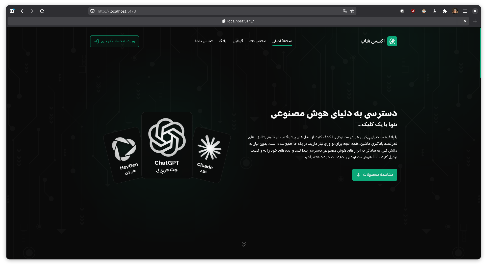
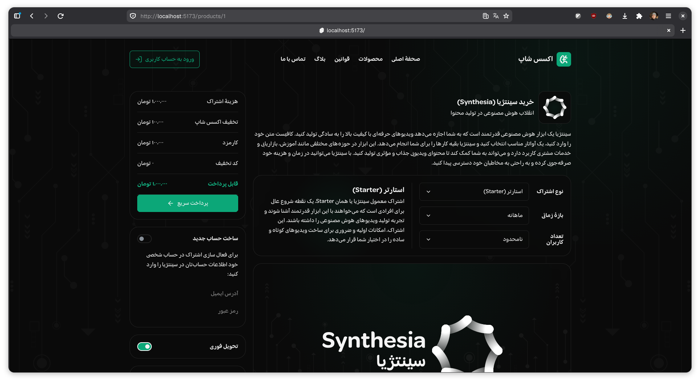

# AccessShop 🤖

**A unified storefront for AI tool subscriptions** — one place to purchase access to services like ChatGPT, Claude, HeyGen, Synthesia, and more.

> Source code is private. This repository showcases the UI and product.

---

## Stack

| Layer | Tech |
|---|---|
| Framework | SvelteKit |
| Styling | CSS |
| UI Design | Designed by me |

---

## Screenshots

### Home

### Product Page

---

## Highlights

- Clean dark UI with a tech/AI aesthetic
- Product pages with subscription tier selection, pricing breakdown, and instant purchase flow
- Supports discount codes and promo pricing
- Designed and built entirely by me
